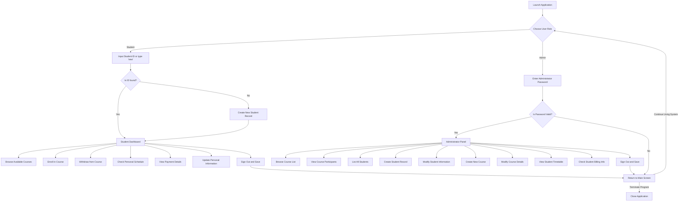

# unknownapp
This is an unknown application written in Java

---- For Submission (you must fill in the information below) ----
### Use Case Diagram

### Flowchart of the main workflow

### Prompts
"I selected the use case "Create New Student Profile", so your task is to create an equivalent Python version that allows users to input student ID, name, and major, store the data, and prevent duplicate IDs."
